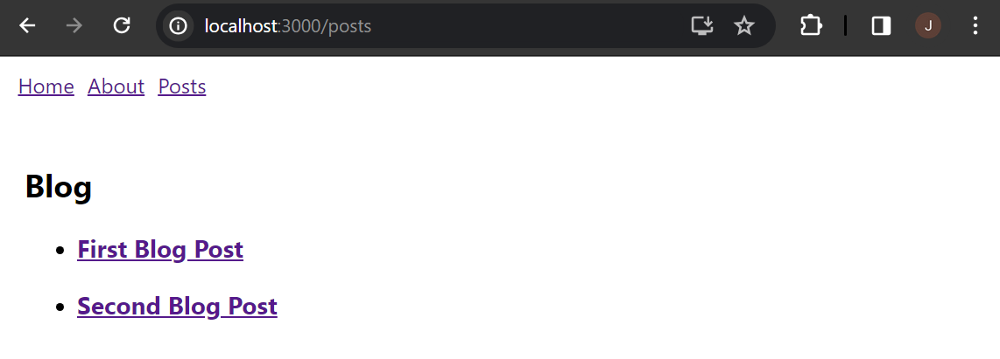

# web603-class-w7d2

## Getting Started

Create a React app "react-router-example" from scratch:
```bash
$ npx create-react-app react-router-example
```

Install dependencies by:
```bash
$ npm install history react-router-dom
```

And then complete the code based on the instruction.

## Test

### Home View


### About View


### Posts View


Post 1


Post 2

